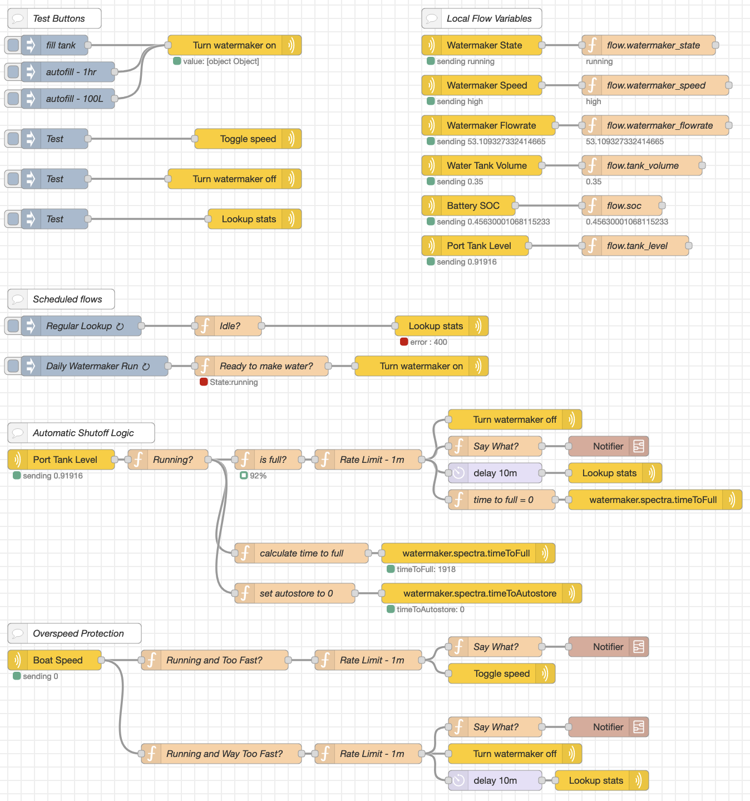

# signalk-spectra-plugin
Spectra Watermaker plugin for SignalK

This is a plugin that allows you to read data from and control a Spectra Watermaker that is equipped with a Spectra Connect interface.

There are currently 4 PUT paths for controlling the watermaker:

* watermaker.spectra.control.start - start the watermaker.
* watermaker.spectra.control.toggleSpeed - toggle the speed between high/low
* watermaker.spectra.control.stop - stop the watermaker
* watermaker.spectra.control.lookupStats - look up stats (this will cause the interface to scroll through various pages to load stats.)

Here is an [example Node-RED flow](nodered-flow.json) for controlling your watermaker:

Here is an [example Grafana dashboard](grafana-dashboard.json) for displaying Watermaker data:

